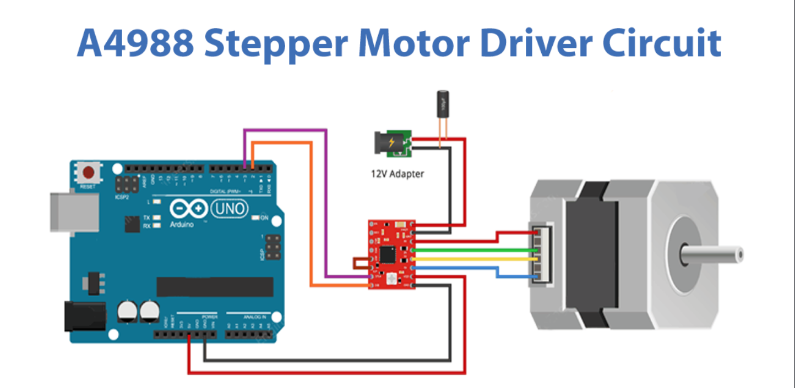

# 🚀 Stepper Motor Control with Arduino (A4988 Driver)

This project demonstrates how to control a stepper motor using an Arduino and an A4988 stepper driver module. The motor rotates clockwise and counterclockwise at different speeds using simple digital pin control.

---

## 🧰 Hardware Required

- Arduino UNO (or compatible board)  
- A4988 Stepper Motor Driver  
- Stepper Motor (e.g., NEMA 17)  
- External Power Supply (e.g., 12V Adapter)  
- Breadboard and Jumper Wires

---

## 🖼️ Circuit Diagram



> **Youtube Video:** [click here](https://youtube.com)

---

## ⚙️ Pin Connections

| Arduino Pin | A4988 Pin | Description         |
|-------------|-----------|---------------------|
| 2           | DIR       | Sets rotation direction |
| 3           | STEP      | Pulse to move 1 step   |
| GND         | GND       | Common ground         |
| 5V          | VDD       | Logic power           |
| 12V Adapter | VMOT      | Motor power           |

---

## 🧠 Code Explanation

```cpp
const int dirPin = 2;
const int stepPin = 3;
const int stepsPerRevolution = 200;

void setup() {
  pinMode(stepPin, OUTPUT);
  pinMode(dirPin, OUTPUT);
}

void loop() {
  digitalWrite(dirPin, HIGH); // Clockwise
  for (int x = 0; x < stepsPerRevolution; x++) {
    digitalWrite(stepPin, HIGH);
    delayMicroseconds(2000);
    digitalWrite(stepPin, LOW);
    delayMicroseconds(2000);
  }
  delay(1000);

  digitalWrite(dirPin, LOW); // Counterclockwise
  for (int x = 0; x < stepsPerRevolution; x++) {
    digitalWrite(stepPin, HIGH);
    delayMicroseconds(1000);
    digitalWrite(stepPin, LOW);
    delayMicroseconds(1000);
  }
  delay(1000);
}
